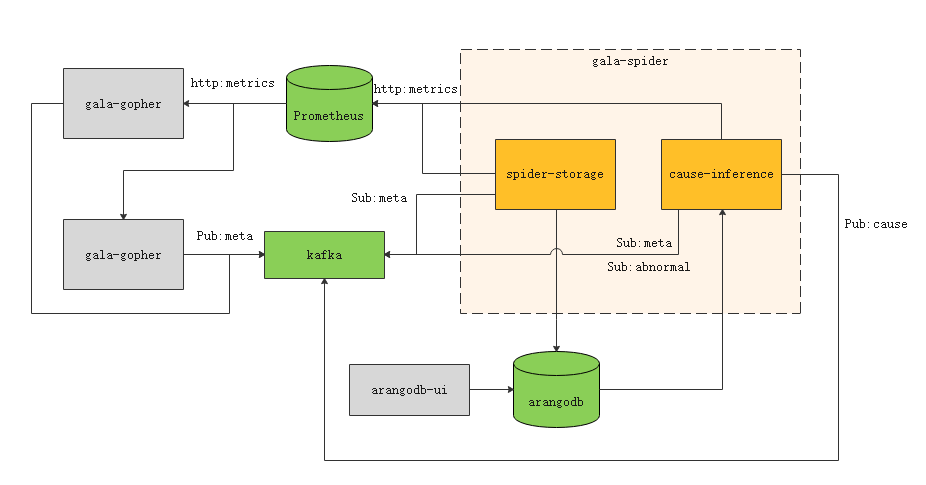
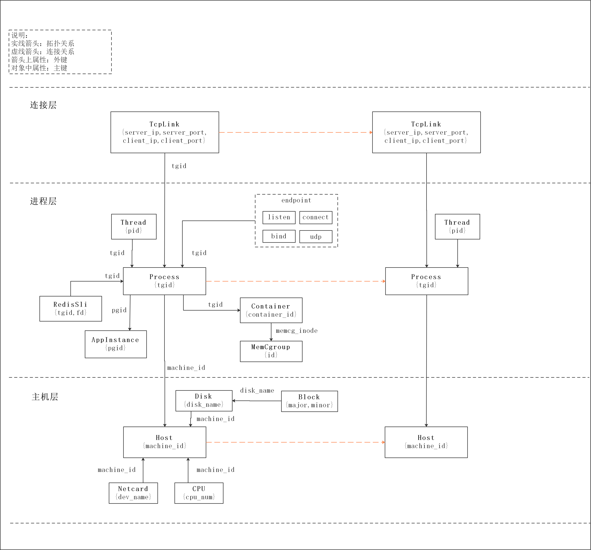

# gala-spider

gala-spider 提供 OS 级别的拓扑图绘制功能，它将定期获取 gala-gopher （一个 OS 层面的数据采集软件）在某个时间点采集的所有观测对象的数据，并计算它们之间的拓扑关系，最终将生成的拓扑图保存到图数据库 arangodb 中。

## 功能特性

gala-spider 项目提供了两个功能模块，它们分别是：

- **spider-storage**：提供 OS  级别观测对象的拓扑图绘制功能，拓扑图结果会存入图数据库 arangodb 中，可通过 arangodb 提供的 UI 界面查询。
- **gala-inference**：提供异常 KPI 的根因定位能力，它基于异常检测的结果和拓扑图作为输入，并将根因定位的结果输出到 kafka 中。

## 软件架构



其中，虚线框内为 gala-spider 项目的 2 个功能组件，绿色部分为 gala-spider 项目直接依赖的外部组件，灰色部分为 gala-spider 项目间接依赖的外部组件。

- **spider-storage**：gala-spider 核心组件，提供拓扑图存储功能。它从 kafka 获取观测对象的元数据信息，进一步从 Prometheus 获取所有的观测实例信息，最终将生成的拓扑图存储到图数据库 arangodb 中。
- **gala-inference**：gala-spider 核心组件，提供根因定位功能。它通过订阅 kafka 的异常 KPI 事件触发异常 KPI 的根因定位流程，并基于 arangodb 获取的拓扑图来构建故障传播图，最终将根因定位的结果输出到 kafka 中。
- **Prometheus**：时序数据库，gala-gopher 组件采集的观测指标数据会上报到 Prometheus，再由 gala-spider 做进一步处理。
- **kafka**：消息中间件，用于存储 gala-gopher 上报的观测对象元数据信息，异常检测组件上报的异常事件，以及 cause-inference 组件上报的根因定位结果。
- **arangodb**：图数据库，用于存储 spider-storage 生成的拓扑图。
- **gala-gopher**：数据采集组件，详细内容参见 [gala-gopher 项目](https://gitee.com/openeuler/A-Ops/tree/master/gala-gopher)。
- **arangodb-ui**：arangodb 提供的 UI 界面，可用于查询拓扑图。

## 快速开始

### gala-spider 软件部署

#### spider-storage 软件部署

1. 基于源码编译、安装、运行

   - 构建

     ```
     /usr/bin/python3 setup.py build
     ```

   - 安装

     ```
     /usr/bin/python3 setup.py install
     ```

   - 运行

     ```
     spider-storage
     ```

2. 基于rpm包安装运行

   - 配置 yum 源

     ```
     [oe-2209]      # openEuler 2209 官方发布源
     name=oe2209
     baseurl=http://119.3.219.20:82/openEuler:/22.09/standard_x86_64
     enabled=1
     gpgcheck=0
     priority=1
     
     [oe-2209:Epol] # openEuler 2209：Epol 官方发布源
     name=oe2209_epol
     baseurl=http://119.3.219.20:82/openEuler:/22.09:/Epol/standard_x86_64/
     enabled=1
     gpgcheck=0
     priority=1
     ```

   - 安装

     ```
     yum install gala-spider
     ```

   - 运行

     ```
     systemctl start gala-spider
     ```

3. 基于 docker 容器化部署

   - 生成容器镜像

     在 gala-spider 项目根目录下，执行：

     ```sh
     docker build -f ./ci/gala-spider/Dockerfile -t gala-spider:1.0.0 .
     ```

     需要注意的是，生成容器镜像的过程中需要从 pip 源中下载依赖包，如果默认的 pip 源不可用，可通过修改 `./ci/gala-spider/Dockerfile` 配置可用的 pip源，修改示例如下：

     ```sh
     # config pip source
     RUN pip3 config set global.index-url https://mirrors.tools.huawei.com/pypi/simple \
         && pip3 config set install.trusted-host mirrors.tools.huawei.com
     ```

   - 运行容器

     在部署环境中，执行：

     ```sh
     docker run -e prometheus_server=192.168.122.251:9090 -e arangodb_server=192.168.122.103:8529 -e kafka_server=192.168.122.251:9092 -e log_level=DEBUG gala-spider:1.0.0
     ```

     环境变量说明：若不指定，则使用配置文件默认配置。

     - prometheus_server ：指定 Prometheus 服务器地址
     - arangodb_server ：指定 arangodb 服务器地址
     - kafka_server ：指定 kafka 服务器地址
     - log_level ：指定 gala-spider 日志打印级别

     此外，如果需要从宿主机的配置文件中启动容器，可通过挂载卷的方式执行：

     ```sh
     docker run -e prometheus_server=192.168.122.251:9090 -e arangodb_server=192.168.122.103:8529 -e kafka_server=192.168.122.251:9092 -e log_level=DEBUG -v /etc/gala-spider:/etc/gala-spider -v /var/log/gala-spider:/var/log/gala-spider gala-spider:1.0.0
     ```

     需要说明的是，

     - 如果宿主机目录 `/etc/gala-spider` 中不存在配置文件，则容器会在第一次启动时将默认的配置文件复制到宿主机目录 `/etc/gala-spider` 中。
     - 如果宿主机目录 `/etc/gala-spider` 中相关的配置文件已存在，它将会覆盖容器中默认的配置文件。此时，通过 `-e` 参数指定的配置项将会失效。

     此外，可以通过 `-v /var/log/gala-spider:/var/log/gala-spider` 将容器运行的日志文件映射到宿主机上，方便后续查看。

#### gala-inference 软件部署

1. 基于源码编译、安装、运行

   - 构建

     ```
     /usr/bin/python3 setup.py build
     ```

   - 安装

     ```
     /usr/bin/python3 setup.py install
     ```

   - 运行

     ```
     gala-inference
     ```

2. 基于rpm包安装

    - 配置 yum 源

      同 spider-storage 软件部署中 yum 源配置。

    - 安装

      ```sh
      yum install gala-inference
      ```

    - 运行

      ```sh
      systemctl start gala-inference
      ```

3. 基于 docker 容器化部署

    - 生成容器镜像

      在 gala-spider 项目根目录下，执行：

      ```sh
      docker build -f ./ci/gala-inference/Dockerfile -t gala-inference:1.0.0 .
      ```

      需要注意的是，生成容器镜像的过程中需要从 pip 源中下载依赖包，如果默认的 pip 源不可用，可通过修改 `./ci/gala-inference/Dockerfile` 配置可用的 pip源，修改示例如下：

      ```sh
      # config pip source
      RUN pip3 config set global.index-url https://mirrors.tools.huawei.com/pypi/simple \
          && pip3 config set install.trusted-host mirrors.tools.huawei.com
      ```

    - 运行容器

      在部署环境中，执行：

      ```sh
      docker run -e prometheus_server=192.168.122.251:9090 -e arangodb_server=192.168.122.103:8529 -e kafka_server=192.168.122.251:9092 -e log_level=DEBUG gala-inference:1.0.0
      ```

      环境变量说明：若不指定，则使用配置文件默认配置。

      - prometheus_server ：指定 Prometheus 服务器地址
      - arangodb_server ：指定 arangodb 服务器地址
      - kafka_server ：指定 kafka 服务器地址
      - log_level ：指定 gala-inference 日志打印级别

      此外，如果需要从宿主机的配置文件中启动容器，可通过挂载卷的方式执行：

      ```sh
      docker run -e prometheus_server=192.168.122.251:9090 -e arangodb_server=192.168.122.103:8529 -e kafka_server=192.168.122.251:9092 -e log_level=DEBUG -v /etc/gala-inference:/etc/gala-inference -v /var/log/gala-inference:/var/log/gala-inference gala-inference:1.0.0
      ```

      需要说明的是，

      - 如果宿主机目录 `/etc/gala-inference` 中不存在配置文件，则容器会在第一次启动时将默认的配置文件复制到宿主机目录 `/etc/gala-inference` 中。
      - 如果宿主机目录 `/etc/gala-inference` 中相关的配置文件已存在，它将会覆盖容器中默认的配置文件。此时，通过 `-e` 参数指定的配置项将会失效。

      此外，可以通过 `-v /var/log/gala-inference:/var/log/gala-inference` 将容器运行的日志文件映射到宿主机上，方便后续查看。


### gala-spider 外部依赖软件部署

- prometheus 部署
- kafka 部署
- **arangodb 部署**

#### arangodb 部署

arangodb运行环境要求：

- x86 系统
- gcc10 以上


我们使用的 arangodb 版本是 3.8.7 ，arangodb 官方部署文档参见：[arangodb部署](https://www.arangodb.com/docs/3.9/deployment.html) 。

1. 通过 rpm 部署

   首先，从 openEuler22.09:Epol 源安装 arangodb3 ，
   
   ```sh
   yum install arangodb3
   ```
   
   启动 arangodb3 服务器，
   
   ```sh
   systemctl start arangodb3
   ```
   
   启动之前，可通过配置文件 `/etc/arangodb3/arangod.conf` 修改配置，如修改 `authentication = false` 关闭身份认证。
   
2. 通过 docker 部署

   ```shell
   docker run -e ARANGO_NO_AUTH=1 -p 192.168.0.1:10000:8529 arangodb/arangodb arangod \
     --server.endpoint tcp://0.0.0.0:8529\
   ```

   选项说明：

   - `arangod --server.endpoint tcp://0.0.0.0:8529`：在容器中启动 arangod 服务，`--server.endpoint` 指定了服务器地址。

   - `-e ARANGO_NO_AUTH=1`：配置 arangodb 的身份认证的环境变量，`ARANGO_NO_AUTH=1` 表示不启动身份认证，即无需用户名/密码即可访问 arangodb 数据库，该配置值用于测试环境。
   - `-p 192.168.0.1:10000:8529`：建立本地 IP 地址（如 `192.168.0.1` 的 1000 端口）到 arangodb 容器的 8529 端口的端口转发。

   详细的部署文档参见：[通过docker部署arangodb](https://www.arangodb.com/docs/3.9/deployment-docker.html)。


## 使用指南

### 配置文件介绍

[配置文件介绍](docs/guide/zh-CN/conf_introduction.md)

### 3D 拓扑图分层架构



观测对象说明：
1. Host：主机/虚拟机节点
    - machine_id：主机ID，用于标识网络中的一台主机/虚拟机。
  
2. Container：容器节点
    - container_id：容器ID，用于标识主机/虚拟机上的容器。
    - machine_id：主机ID，用于关联容器所属的主机/虚拟机。
    - netns：容器所在的 net namespace 。
    - mntns：容器所在的 mount namespace 。
    - netcgrp：容器关联的 net cgroup 。
    - memcgrp：容器关联的 memory cgroup 。
    - cpucgrp：容器关联的 cpu cgroup 。
    
3. Task：进程节点
    - pid：进程ID，用于标识主机/虚拟机或容器上运行的一个进程。
    - machine_id：主机ID，用于关联进程所属的主机/虚拟机。
    - container_id：容器ID，用于关联进程所属的容器。
    - tgid：进程组ID。
    - pidns：进程所在的 pid namespace 。
    
4. Endpoint：进程的通信端点
    - type：端点类型，如 TCP 、UDP 等。
    - ip：端点绑定的 ip 地址，可选项。
    - port：端点绑定的端口号，可选项。
    - pid：进程ID，用于关联端点所属的进程ID。
    - netns：端点所在的 net namespace 。
    
5. Jvm：Java程序运行时
6. Python：Python程序运行时
7. Golang：Go程序运行时

8. AppInstance: 应用实例节点
    - pgid：进程组ID，用于标识一个应用实例。
    - machine_id：主机ID，用于关联应用实例所属的主机/虚拟机。
    - container_id：容器ID，用于关联应用实例所属的容器。
    - exe_file: 应用可执行文件，用于标识一个应用。
    - exec_file：应用被执行文件，用于标识一个应用。

### 接口文档

[拓扑图查询Restful API](docs/guide/zh-CN/api/3d-topo-graph.md)

[根因定位结果API](docs/guide/zh-CN/api/cause-infer.md)

### 如何新增观测对象
[如何新增观测对象](docs/devel/zh-CN/how_to_add_new_observe_object.md)


## 项目路线图

| 特性                                                         | 发布时间 | 发布版本            |
| ------------------------------------------------------------ | -------- | ------------------- |
| 基于TCP会话构建应用实时业务拓扑（包括Nginx、Haproxy等会话）  | 22.12    | openEuler 22.03 SP1 |
| 构建主机内应用资源依赖拓扑（包括QEMU的拓扑关系）             | 22.12    | openEuler 22.03 SP1 |
| 基于L7层会话构建K8S POD实时拓扑（包括HTTP1.X/MySQL/PGSQL/Redis/Kafka/MongoDB/DNS/RocketMQ） | 23.09    | openEuler 22.03 SP1 |
| 构建分布式存储实时拓扑（Ceph）                               | 24.03    | openEuler 24.03     |
|                                                              |          |                     |

